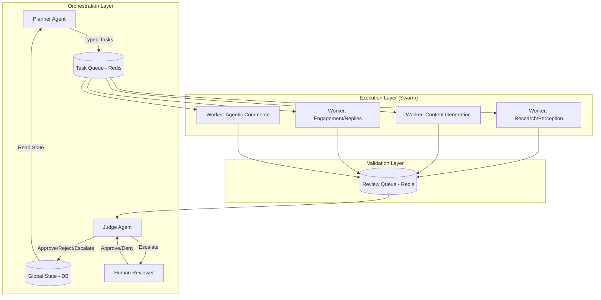
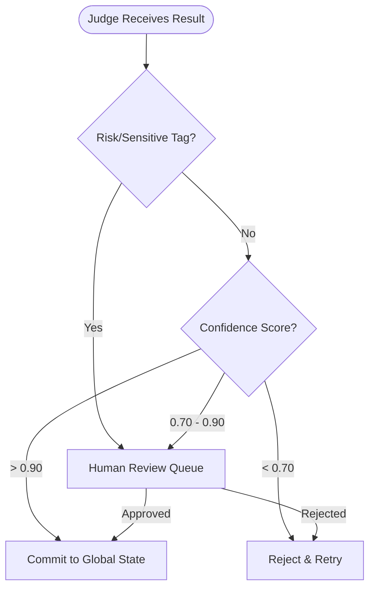
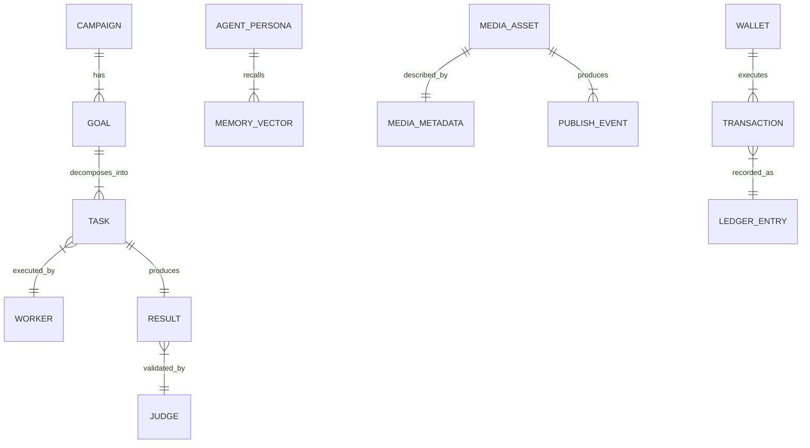

# Architecture Strategy

## Summary

This document defines the high-level architecture for Project Chimera: an infrastructure factory for Autonomous AI Influencers. The architecture uses a FastRender Swarm (Planner–Worker–Judge) to combine centralized governance with horizontally scalable execution. The system is designed for Spec-Driven Development (SDD): specifications, schemas, and acceptance criteria are the source of truth, and the runtime enforces traceability, safety, and determinism.

Project Chimera is also designed to operate as a protocol-compliant node in a broader Agent Social Network (e.g., OpenClaw), exposing capabilities through standardized interfaces instead of tight coupling.

---

## Agent Pattern: FastRender Swarm (Planner–Worker–Judge)

The architecture rejects brittle sequential chains in favor of constrained parallelism: planning and governance are centralized; execution is parallelized; validation gates all external effects.

### Core Roles

1. **Planner (Strategist)**

- **Responsibility:** Reads `GlobalState` (campaign goals, budgets, constraints, recent observations) and decomposes objectives into a Directed Acyclic Graph (DAG) of atomic tasks.
- **Control Model:** Single-writer for planning decisions to avoid conflicting strategies.
- **Output:** Typed `Task` objects pushed to `TaskQueue` (Redis).

2. **Worker (Executor)**

- **Responsibility:** Stateless execution of one task at a time using external tools via MCP.
- **Isolation:** Shared-nothing; workers do not communicate with each other; ephemeral compute.
- **Output:** Typed `Result` objects pushed to `ReviewQueue`.

3. **Judge (Gatekeeper)**

- **Responsibility:** Validates every `Result` against acceptance criteria, safety policy, brand policy, and budget/commerce constraints.
- **Authority:** `APPROVE` (commit), `REJECT` (retry), `ESCALATE` (HITL).
- **State Commit:** Uses Optimistic Concurrency Control (OCC) to prevent race conditions during state updates.

### Task Lifecycle Protocol

All task handoffs are protocol-driven and machine-readable.

- **Task Schema:** JSON Schema / typed contract defining:
  - `task_id`, `goal_id`, `task_type`, `inputs`, `constraints`, `acceptance_criteria`, `risk_tags`, `budget_scope`, `idempotency_key`
- **Task States:** `PENDING` → `IN_PROGRESS` → `IN_REVIEW` → `COMPLETE` | `FAILED` | `ESCALATED`
- **Idempotency:** Workers must be safe to retry; `idempotency_key` prevents double-posting/double-spend.

### Swarm Topology Diagram

## Human-in-the-Loop (HITL) Governance

Autonomy is bounded by a mandatory validation gate. Every external effect (publishing, messaging, spending) is authorized by the Judge based on confidence, risk tags, and policy constraints.

### Decision Logic

- Auto-Approve: confidence_score > 0.90 AND no sensitive tags.
- Async Approval: 0.70 ≤ confidence_score ≤ 0.90 → Human Review Queue.
- Reject/Retry: confidence_score < 0.70 → Reject; Planner retries with adjusted parameters.
- Mandatory Review (Always HITL): Any action tagged with:

  - Politics
  - Financial Advice / Financial Claims
  - Legal Claims
  - High-Risk Brand Safety

- Commerce Guardrails:

- Any transaction exceeding configured daily budget caps → ESCALATE or REJECT
- On-chain verification required for any settlement/transfer steps.

### HITL Workflow Diagram

## Spec-Driven Development (SDD) & Traceability

The system is built so an agent (or human engineer) can safely extend behavior by following explicit specifications, schemas, and contracts.

Chimera*Agentic_Infrastructure*…

### Required Spec Artifacts

- SRS / System Specs: Requirements, constraints, and non-functional expectations.
- SOUL.md (Persona Contract): Agent identity, tone constraints, role boundaries, and governance rules.
- Tool Schemas: MCP tool definitions including inputs/outputs and capability discovery.
- Task/Result Schemas: JSON schemas + acceptance criteria templates.
- Audit Expectations: Every approved external effect must have:
- inputs, tool calls, outputs, confidence, risk tags, reviewer decision, timestamps.

## Data & Persistence Strategy (Polyglot Persistence)

Chimera uses purpose-fit storage based on velocity, consistency, and access patterns rather than a single database for all workloads.

Chimera*Agentic_Infrastructure*…

### Data Stores

1. Transactional Store (PostgreSQL)

- Usage: Accounts, campaign configurations, governance policies, budgets, financial ledger entries, immutable audit records.
- Reason: ACID guarantees for billing, permissions, and compliance.

2. Semantic Memory (Vector DB: Weaviate)

- Usage: Long-term memory, persona retrieval, world knowledge snapshots, RAG retrieval.
- Reason: Semantic recall for agent context.

3. Episodic + Queues + Locks (Redis)

- Usage: TaskQueue, ReviewQueue, short-lived context windows, rate-limiters, mutex/lease locks for OCC.
- Reason: Sub-millisecond latency for orchestration loops.

4. High-Velocity Media Metadata (NoSQL Document/KV Store)

- Usage: Media generation metadata that evolves rapidly under bursty parallel writes:
  - prompts, model params, versioning, character consistency IDs, scores, retries, platform publish fields.
- Reason: Schema flexibility + high write throughput; avoid continual SQL schema migrations and write contention.

5. Media Asset Storage (Object Store)

- Usage: Images/videos, thumbnails, intermediate renders, transcoded outputs.
- Reason: Large binary storage, lifecycle policies, CDN integration.

### Conceptual Entity Relationship Overview

## Integration Strategy (MCP)

All external interactions occur through MCP to isolate core orchestration logic from third-party API volatility, enable testability, and support capability discovery.

Chimera*Agentic_Infrastructure*…

### MCP Architecture

- MCP Host: Swarm runtime container(s) hosting Planner/Judge services and Worker pools.
- MCP Servers (Tools):
  - mcp-server-social: posting, engagement, analytics (platform-specific adapters behind a stable tool interface)
  - mcp-server-media-gen: image/video generation tools
  - mcp-server-search: web/news retrieval and citation capture
  - mcp-server-memory: vector retrieval + embeddings
  - mcp-server-wallet: wallet identity, signing, transaction execution, on-chain verification

### Tool Governance Requirements

- Tools must declare:

  - capabilities, input/output schemas, rate limits, side-effect classification (read vs write), and idempotency expectations.

- The Judge must validate:

  - tool selection appropriateness, output compliance, and side-effect authorization before any commit.

## Agent Social Network Compatibility (OpenClaw Model)

Chimera is designed as a protocol-compliant agent organization that participates in a broader agent ecosystem without sharing internal implementation or requiring direct agent-to-agent messaging.

### Social Protocol Categories

1. Capability & Identity Protocols

   - Capability discovery via MCP tool schemas.
   - Persona/identity declared through SOUL.md and explicit constraints.

2. Task & Coordination Protocols

   - Inter-agent coordination uses typed intents (task/result schemas) and queue-based handoffs rather than free-form chat.

3. Economic & Trust Protocols

   - Wallet-based identity, on-chain verification, budget enforcement, anomaly checks for agentic commerce.

4. Governance & Safety Protocols

   - Confidence scores, risk tags, escalation thresholds, and HITL signaling act as enforceable contracts for safe interoperability.
