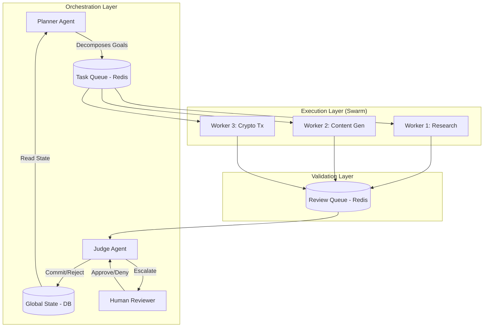
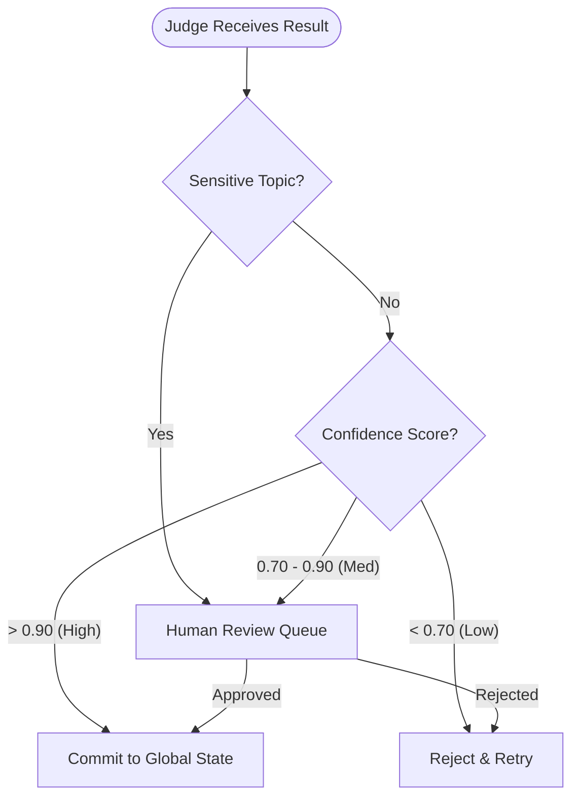
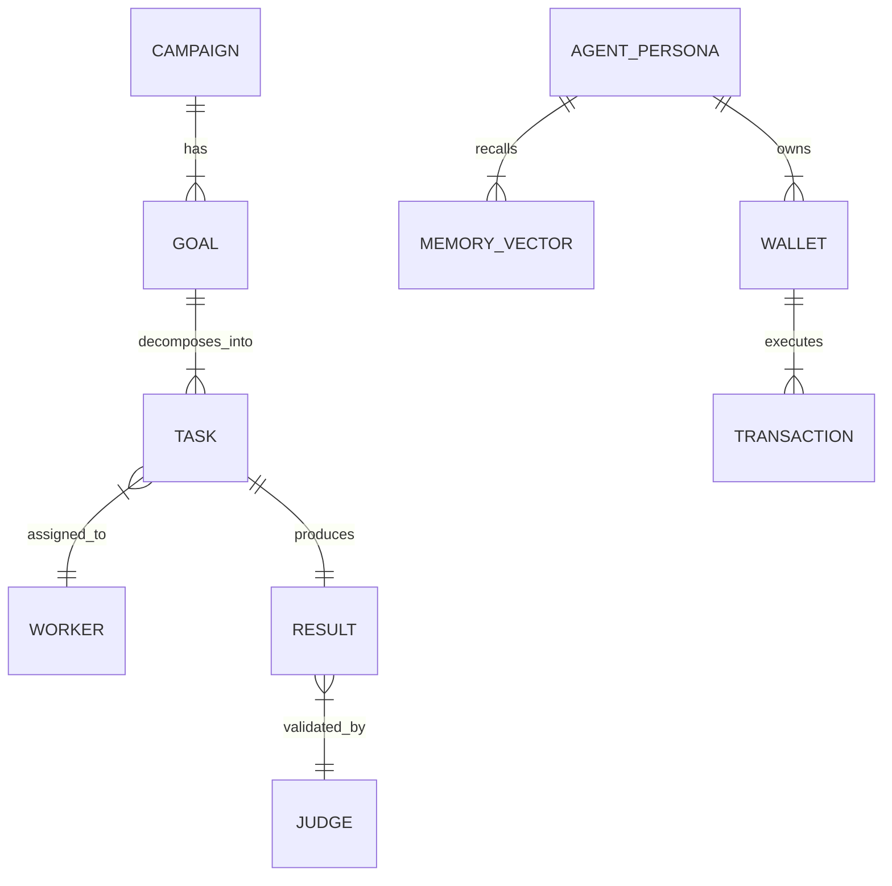

# Architecture Strategy

## Summary

This document defines the high-level architecture for Project Chimera, the infrastructure factory for Autonomous AI Influencers. Our strategy pivots away from fragile, monolithic scripts towards a FastRender Swarm architecture. This ensures scalability, error recovery, and strict governance through a "Planner-Worker-Judge" separation of concerns.

We adhere to Spec-Driven Development (SDD): Intent is the source of truth, and infrastructure ensures reliability.

## Agent Pattern: The FastRender Swarm

We reject the sequential chain pattern (which is brittle and prone to cascading failures) in favor of the Hierarchical Swarm (FastRender Pattern). This pattern decouples strategy from execution and execution from validation.

### Core Roles

The swarm consists of three specialized agent types:

1. The Planner (Strategist):

- Responsibility: Monitors GlobalState (campaign goals, trends). Decomposes high-level goals into a Directed Acyclic Graph (DAG) of atomic tasks.
- Behavior: Reactive. If a Worker fails or news shifts, the Planner re-optimizes the task graph dynamically.
- Output: Task objects pushed to the TaskQueue (Redis).

2. The Worker (Executor):

- Responsibility: Stateless execution. Picks a single Task from the queue, executes it using MCP Tools (e.g., generate_image, search_web), and produces a Result.
- Isolation: Shared-nothing architecture. Workers do not communicate with each other.
- Output: Result objects pushed to the ReviewQueue.

3. The Judge (Gatekeeper):

- Responsibility: QA and Governance. Validates Result artifacts against acceptance criteria and safety policies.
- Authority: Can Approve (commit to state), Reject (retry), or Escalate (trigger HITL).
- Concurrency: Uses Optimistic Concurrency Control (OCC) to prevent race conditions during state updates.

### Swarm Topology Diagram

## Human-in-the-Loop (HITL) Strategy

Autonomy does not mean lack of supervision. We implement a Probability-Based Safety Layer to ensure brand safety and financial security.

### Decision Logic

The Judge Agent is the sole enforcement point for HITL. It routes tasks based on two factors: Confidence Score and Sensitive Topic Filters.

- Auto-Approve: Confidence > 0.90 AND No Sensitive Topics detected. Action executes immediately.
- Async Approval (Queue): Confidence 0.70 - 0.90. Task is paused and added to the Dashboard Queue for human operator sign-off.
- Reject/Retry: Confidence < 0.70. Judge rejects the output and instructs Planner to retry with new parameters.
- Mandatory Review: Any content flagging "Politics," "Financial Advice," or "Legal Claims" is routed to HITL regardless of confidence.
- CFO Guardrail: Any financial transaction (Agentic Commerce) exceeding the daily budget limit is strictly rejected or escalated.

### HITL Workflow Diagram

## Database & Data Strategy

We utilize a Hybrid Data Architecture to handle the distinct requirements of high-velocity memory, transactional integrity, and episodic state.

### Data Stores

1. Transactional (PostgreSQL):

- Usage: User accounts, Campaign Configurations, Financial Ledgers, Operational Logs.
- Why: ACID compliance is non-negotiable for billing and user management.

2. Semantic Memory (Weaviate):

- Usage: Agent "Soul" (Persona), Long-term memories, World Knowledge.
- Why: Vector search enables the agent to recall context ("Who am I?", "What did I say last month?") via RAG pipelines.

3. Episodic/Cache (Redis):

- Usage: Task Queues (TaskQueue, ReviewQueue), Short-term conversation history (Context Window), Mutex locks for OCC.
- Why: Sub-millisecond latency is required for the high-frequency Planner-Worker loops.

### Entity Relationship Overview (Conceptual)

## Integration Strategy (MCP)

All external interactions act through the Model Context Protocol (MCP). This separates our core logic from API volatility.

### MCP Architecture

- **MCP Host**: The Agent Swarm Container.
- **MCP Servers (Tools)**:
  - `mcp-server-twitter`: Social actions (posting, engagement, analytics).
  - `mcp-server-coinbase`: Wallet management (Agentic Commerce transactions).
  - `mcp-server-weaviate`: Memory retrieval and semantic search.

### Benefits

- **Decoupling**: Core agent logic remains independent of external API changes.
- **Testability**: MCP servers can be mocked or replaced for testing.
- **Extensibility**: New integrations are added as MCP servers without modifying core swarm logic.
