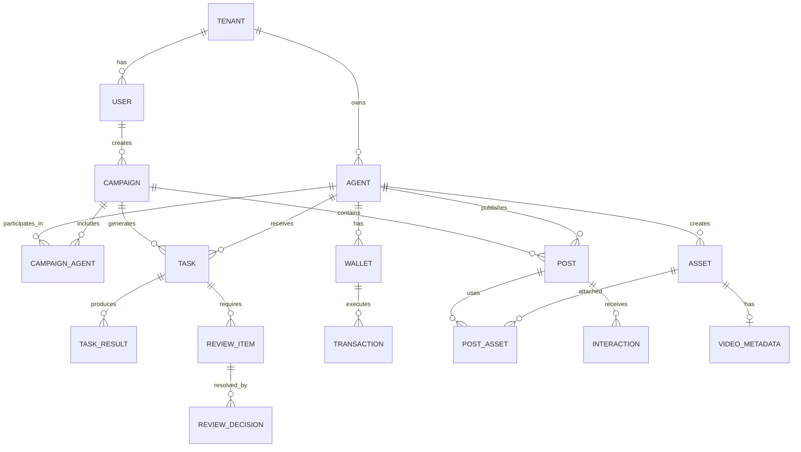

# Technical Specification

## 1) System Components (MVP)

- Platform UI (Next.js) calls Orchestrator APIs only.
- Orchestrator service owns global state and persistence.
- Planner, Worker, and Judge are implemented as decoupled services.
- Redis is used for TaskQueue and ReviewQueue.
- PostgreSQL stores transactional truth (campaigns, tasks, results, posts, approvals, logs).
- Weaviate stores semantic memory and persona-linked memory collections.

---

## 2) Agent-to-Agent API Contracts (JSON)

These JSON contracts are derived from the Project Chimera SRS.

### 2.1 Agent Task (Planner -> Worker)

```json
{
  "task_id": "uuid-v4-string",
  "task_type": "generate_content | reply_comment | execute_transaction | trend_alert",
  "priority": "high | medium | low",
  "context": {
    "goal_description": "string",
    "persona_constraints": ["string"],
    "required_resources": ["mcp://twitter/mentions/123", "mcp://memory/recent"]
  },
  "assigned_worker_id": "string",
  "created_at": "timestamp",
  "status": "pending | in_progress | review | complete"
}
```

---

### 2.2 Worker Result (Worker -> Judge)

```json
{
  "task_id": "uuid-v4-string",
  "worker_id": "string",
  "result_type": "content_draft | social_action_request | transaction_request | trend_alert",
  "status": "success | failure",
  "artifact": {
    "text_content": "string",
    "media_urls": ["string"],
    "platform": "twitter | instagram | threads",
    "transaction": {
      "to_address": "string",
      "amount": 0.0,
      "asset": "USDC | ETH",
      "chain": "base | ethereum | solana"
    }
  },
  "confidence_score": 0.0,
  "reasoning_trace": "string",
  "started_at": "timestamp",
  "finished_at": "timestamp",
  "error": {
    "code": "string",
    "message": "string"
  }
}
```

---

### 2.3 Review Decision (Judge / HITL -> Orchestrator)

```json
{
  "task_id": "uuid-v4-string",
  "reviewer_type": "judge | human",
  "decision": "approve | reject | edit",
  "edited_artifact": {
    "text_content": "string",
    "media_urls": ["string"]
  },
  "confidence_score": 0.0,
  "reasoning_trace": "string",
  "state_version_observed": "string",
  "created_at": "timestamp"
}
```

---

## 3) MCP Tool Contracts (JSON Schema)

### 3.1 Social Publish Tool

```json
{
  "name": "post_content",
  "description": "Publishes text and media to a connected social platform.",
  "inputSchema": {
    "type": "object",
    "properties": {
      "platform": {
        "type": "string",
        "enum": ["twitter", "instagram", "threads"]
      },
      "text_content": {
        "type": "string"
      },
      "media_urls": {
        "type": "array",
        "items": { "type": "string" }
      },
      "disclosure_level": {
        "type": "string",
        "enum": ["automated", "assisted", "none"]
      }
    },
    "required": ["platform", "text_content"]
  }
}
```

---

### 3.2 Image Generation Tool (Character Consistency)

```json
{
  "name": "generate_image",
  "description": "Generates a character-consistent image.",
  "inputSchema": {
    "type": "object",
    "properties": {
      "prompt": { "type": "string" },
      "character_reference_id": { "type": "string" },
      "style_lora_id": { "type": "string" },
      "aspect_ratio": {
        "type": "string",
        "enum": ["1:1", "9:16", "16:9"]
      }
    },
    "required": ["prompt", "character_reference_id"]
  }
}
```

---

## 4) Database Schema (Mermaid ERD)



---

## 5) Non-Functional Contracts

- Every Worker output MUST include `confidence_score`.
- Sensitive topics ALWAYS require HITL.
