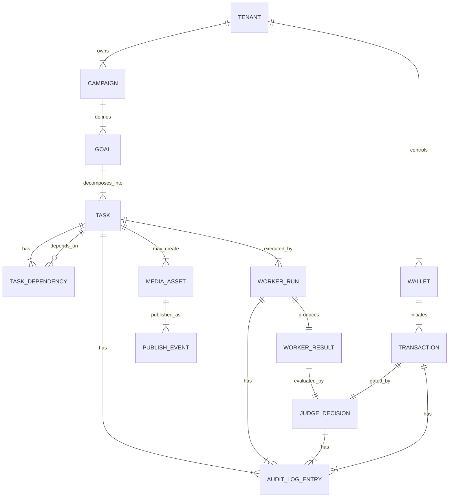

## Project Chimera – Technical Specification

This document defines **machine‑readable contracts and structural guarantees** for Project Chimera, with an emphasis on:

- Agent API envelopes for Planner, Worker, Judge, and Skills.
- Database/entity relationships for tasks, results, media, and audit trails.
- Explicit invariants for idempotency, optimistic concurrency control (OCC), and traceability.

The intent is to provide durable contracts that can survive implementation changes and technology refreshes.

---

### 1. Identifier and Envelope Conventions

#### 1.1 Identifier Rules

- All primary identifiers (`*_id`) are **opaque strings** with at least 128 bits of effective entropy.
- Identifiers carry **no semantic meaning** (no embedded timestamps, types, or tenant information).
- Every record or message that can be traced from outside the system MUST include:
  - `tenant_id`
  - `campaign_id` (where applicable)
  - A stable `task_id` or equivalent lineage anchor.

#### 1.2 Common Envelope Fields

All agent‑to‑agent and agent‑to‑skill messages MUST use envelopes that share the following fields:

```json
{
  "id": "string", // Unique envelope identifier
  "tenant_id": "string",
  "campaign_id": "string|null",
  "goal_id": "string|null",
  "task_id": "string|null",
  "correlation_id": "string|null", // Optional external or UI-linked ID
  "created_at": "RFC3339 timestamp",
  "role": "planner|worker|judge|skill|system",
  "type": "string", // Domain-specific message type
  "status": "pending|in_progress|complete|failed|rejected|approved|escalated",
  "confidence_score": 0.0,
  "risk_tags": ["string"],
  "idempotency_key": "string|null",
  "payload": {}, // Role-specific body (see sections below)
  "error": {
    "code": "string",
    "message": "string",
    "retryable": true,
    "details": {}
  } // Present only on failure states
}
```

**Invariants**

- `tenant_id` MUST be present and valid for all envelopes that can lead to state changes or external effects.
- `idempotency_key` MUST be present for any envelope that could cause an external side effect if re‑executed.
- `confidence_score` MUST be populated by Workers and MAY be defaulted or omitted by other roles when not meaningful.

---

### 2. Planner Contracts

#### 2.1 PlannerTaskEnvelope

Planner creates typed tasks, expressed as immutable specifications.

```json
{
  "id": "string",
  "tenant_id": "string",
  "campaign_id": "string",
  "goal_id": "string",
  "role": "planner",
  "type": "planner.task",
  "status": "pending",
  "confidence_score": 1.0,
  "risk_tags": [],
  "idempotency_key": "string",
  "payload": {
    "task_id": "string",
    "task_type": "trend_research|content_generation|engagement|media_production|commerce|other",
    "description": "string",
    "inputs": {}, // Structured, type-specific inputs
    "constraints": {
      "channels": ["string"],
      "persona_ids": ["string"],
      "safety_policies": ["string"],
      "max_budget": "decimal|null",
      "time_window": {
        "start": "RFC3339 timestamp|null",
        "end": "RFC3339 timestamp|null"
      }
    },
    "acceptance_criteria": [
      {
        "id": "string",
        "description": "string",
        "mandatory": true
      }
    ],
    "priority": "low|normal|high|critical",
    "dependencies": ["task_id"],
    "retry_policy": {
      "max_attempts": 3,
      "backoff_strategy": "exponential|fixed|none"
    }
  }
}
```

**Invariants**

- `task_id` in `payload` MUST be stable and match the canonical task record in the database.
- `acceptance_criteria` MUST be non‑empty for tasks that can lead to external effects.
- Dependencies MUST form a Directed Acyclic Graph (no cycles).

---

### 3. Worker Contracts

Workers consume `PlannerTaskEnvelope` messages and produce `WorkerResultEnvelope` messages.

#### 3.1 WorkerResultEnvelope

```json
{
  "id": "string",
  "tenant_id": "string",
  "campaign_id": "string",
  "goal_id": "string",
  "task_id": "string",
  "role": "worker",
  "type": "worker.result",
  "status": "complete|failed",
  "confidence_score": 0.0,
  "risk_tags": ["string"],
  "idempotency_key": "string",
  "payload": {
    "attempt_number": 1,
    "outputs": {
      "artifacts": [
        {
          "artifact_id": "string",
          "kind": "post_draft|reply_draft|script|image|video|metadata_only|other",
          "summary": "string",
          "content_ref": "string|null", // Pointer to media or text body
          "media_metadata": {
            "duration_seconds": 0,
            "width": 0,
            "height": 0,
            "format": "string",
            "character_id": "string|null"
          }
        }
      ],
      "analysis": {
        "trend_signals": ["string"],
        "rationale": "string",
        "safety_considerations": "string"
      }
    },
    "acceptance_evidence": [
      {
        "criterion_id": "string",
        "satisfied": true,
        "notes": "string"
      }
    ],
    "tool_invocations": [
      {
        "skill_id": "string",
        "tool_name": "string",
        "call_id": "string",
        "status": "success|failed",
        "cost_estimate": {
          "tokens": 0,
          "currency": "string|null",
          "amount": "decimal|null"
        }
      }
    ]
  },
  "error": {
    "code": "string",
    "message": "string",
    "retryable": true,
    "details": {}
  }
}
```

**Invariants**

- `task_id` MUST match an existing task and any stored Planner specification.
- `confidence_score` MUST reflect the Worker’s assessment of overall output suitability and safety.
- `tool_invocations` MUST capture enough detail to be joined with audit logs.

---

### 4. Judge Contracts

Judges produce `JudgeDecisionEnvelope` messages that gate state commits and external effects.

#### 4.1 JudgeDecisionEnvelope

```json
{
  "id": "string",
  "tenant_id": "string",
  "campaign_id": "string",
  "goal_id": "string",
  "task_id": "string",
  "role": "judge",
  "type": "judge.decision",
  "status": "approved|rejected|escalated",
  "confidence_score": 0.0,
  "risk_tags": ["string"],
  "idempotency_key": "string",
  "payload": {
    "result_id": "string",
    "decision": "approve|reject|escalate",
    "reason_summary": "string",
    "policy_checks": [
      {
        "check_id": "string",
        "name": "string",
        "result": "pass|fail|warning",
        "details": "string"
      }
    ],
    "required_actions": [
      {
        "action": "edit|rework|explain|add_disclosure",
        "target_artifact_id": "string|null",
        "notes": "string"
      }
    ],
    "human_review": {
      "required": true,
      "status": "pending|completed|null",
      "reviewer_id": "string|null",
      "decision_timestamp": "RFC3339 timestamp|null"
    },
    "state_version": 0
  }
}
```

**Invariants**

- `state_version` MUST reflect the version of global state used when making the decision (see OCC).
- For `decision = "approve"`, all mandatory policy checks MUST have `result = "pass"` unless an explicit override is recorded in `reason_summary` or a dedicated override field.

---

### 5. Skill (MCP Tool) Contracts

Skills are accessed via a neutral protocol layer; this section defines the expected shape of in‑system requests and responses, independent of transport.

#### 5.1 SkillInvocationRequest

```json
{
  "id": "string",
  "tenant_id": "string",
  "campaign_id": "string|null",
  "task_id": "string|null",
  "skill_id": "string",
  "tool_name": "string",
  "idempotency_key": "string",
  "side_effect": "read|write|read_write",
  "sensitivity": "low|medium|high",
  "payload": {} // Tool-specific input arguments
}
```

#### 5.2 SkillInvocationResponse

```json
{
  "id": "string",
  "request_id": "string",
  "status": "success|failed|partial",
  "confidence_score": 0.0,
  "risk_tags": ["string"],
  "payload": {}, // Tool-specific outputs
  "error": {
    "code": "string",
    "message": "string",
    "retryable": true,
    "details": {}
  },
  "audit": {
    "started_at": "RFC3339 timestamp",
    "finished_at": "RFC3339 timestamp",
    "cost_estimate": {
      "tokens": 0,
      "currency": "string|null",
      "amount": "decimal|null"
    }
  }
}
```

**Invariants**

- `side_effect` MUST accurately classify whether the call can change external state.
- High‑sensitivity or write operations MUST be visible in downstream audit logs with enough information to reconstruct what happened.

---

### 6. Database Schema (Conceptual ERD)

The following Mermaid ERD models the **core entities** for tasks, results, media, and audit. It is conceptual; concrete column names and index strategies MAY vary as long as these relationships and invariants hold.



#### 6.1 Core Tables (Conceptual Fields)

- **TENANT**

  - `id`
  - `name`
  - Invariant: All tenant‑scoped records reference `tenant_id`.

- **CAMPAIGN**

  - `id`, `tenant_id`, `name`, `status`, `persona_id`
  - Invariant: Campaigns cannot span tenants.

- **GOAL**

  - `id`, `tenant_id`, `campaign_id`, `description`, `status`, `created_at`

- **TASK**

  - `id`, `tenant_id`, `campaign_id`, `goal_id`
  - `task_type`, `priority`, `status`
  - `spec_json` (immutable planner specification snapshot)
  - `idempotency_key`
  - `created_at`, `updated_at`, `state_version`
  - Invariants:
    - `spec_json` is append‑only; updates create new tasks or versioned specs rather than mutating history.
    - `state_version` participates in OCC for all updates.

- **TASK_DEPENDENCY**

  - `id`, `tenant_id`, `task_id`, `depends_on_task_id`
  - Invariant: No cycles; DB‑level constraints SHOULD prevent self‑dependency; higher‑level checks SHOULD enforce DAG.

- **WORKER_RUN**

  - `id`, `tenant_id`, `task_id`, `attempt_number`
  - `started_at`, `finished_at`
  - `status`
  - `envelope_id` (link to original Worker envelope for traceability)

- **WORKER_RESULT**

  - `id`, `tenant_id`, `task_id`, `worker_run_id`
  - `status`
  - `confidence_score`
  - `risk_tags_json`
  - `outputs_json` (structured; must reference MEDIA_ASSET and other entities via IDs where applicable)

- **JUDGE_DECISION**

  - `id`, `tenant_id`, `task_id`, `worker_result_id`
  - `decision` (`approve|reject|escalate`)
  - `state_version_used`
  - `reason_summary`
  - `policy_checks_json`
  - `human_review_required` (bool)
  - `human_reviewer_id` (nullable)
  - `decided_at`

- **MEDIA_ASSET**

  - `id`, `tenant_id`, `task_id|null`, `campaign_id`, `kind` (`image|video|audio|other`)
  - `storage_uri`
  - `duration_seconds`, `width`, `height`, `format`
  - `character_id` (nullable)
  - `metadata_json` (e.g. prompts, model parameters, scores)

- **PUBLISH_EVENT**

  - `id`, `tenant_id`, `media_asset_id|null`, `task_id`, `campaign_id`
  - `channel` (e.g. social platform identifier)
  - `external_post_id`
  - `published_at`
  - `status` (`scheduled|published|failed|cancelled`)
  - `disclosure_applied` (bool)

- **WALLET**

  - `id`, `tenant_id`, `agent_or_campaign_id`, `kind` (`commerce|internal`), `provider_ref`

- **TRANSACTION**

  - `id`, `tenant_id`, `wallet_id`
  - `direction` (`debit|credit`)
  - `amount`, `currency`
  - `chain_tx_hash` (nullable)
  - `requested_at`, `executed_at` (nullable)
  - `status` (`pending|approved|executed|failed|cancelled`)
  - `idempotency_key`

- **AUDIT_LOG_ENTRY**
  - `id`, `tenant_id`
  - `subject_type` (`task|worker_run|worker_result|judge_decision|transaction|publish_event|other`)
  - `subject_id`
  - `event_type`
  - `actor_type` (`system|human|external_node`)
  - `actor_id` (nullable)
  - `timestamp`
  - `data_json` (normalized details)
  - Invariant: Records are append‑only; updates are prohibited.

---

### 7. Idempotency and OCC Invariants

#### 7.1 Idempotency

- Any operation that can trigger an external effect (publishing, messaging, transactions) MUST be associated with an `idempotency_key` that:

  - Is unique per logical effect.
  - Is stored on the corresponding `TASK`, `PUBLISH_EVENT`, or `TRANSACTION`.
  - Is checked before executing an effect to prevent duplicates.

- Replaying the same envelope or retrying a failed network call with the same `idempotency_key` MUST NOT generate a second external effect.

#### 7.2 Optimistic Concurrency Control (OCC)

- Entities representing **global or shared state** (e.g. `TASK`, `CAMPAIGN`, budget records) MUST carry a `state_version` integer.
- Update operations MUST:

  - Read the current `state_version`.
  - Include that version in the update request.
  - Fail the update if the stored `state_version` has changed since it was read.

- On OCC conflict:
  - The failed writer MUST re‑read state.
  - Planner MAY replan based on updated state rather than forcing the old intent.
  - Judge MAY re‑evaluate decisions if underlying state invalidates previous assumptions.

---

### 8. Traceability Guarantees

Chimera MUST support the following **end‑to‑end traceability**:

- From any external artifact (post, message, on‑chain transaction) to:

  - `PUBLISH_EVENT` or `TRANSACTION`.
  - Associated `TASK` and `GOAL`.
  - `WORKER_RESULT` and `WORKER_RUN`.
  - `JUDGE_DECISION` and any human approvals.
  - `AUDIT_LOG_ENTRY` records documenting intermediate steps.

- From any human action in the Platform to:
  - One or more `AUDIT_LOG_ENTRY` records referencing the operator and the affected subjects.
  - A unique request or correlation ID that appears in backend logs and telemetry.

**Invariants**

- No approved external effect exists without at least one `AUDIT_LOG_ENTRY` linking it to its origin.
- All cross‑entity links necessary for reconstruction are represented as foreign keys or stored identifiers, not inferred by heuristics.

---

### 9. Error Handling and Status Semantics

- **Status fields**

  - `status` on envelopes and entities MUST reflect the **latest durable state**, not transient in‑memory states.
  - Valid transitions MUST be explicitly modeled (e.g. `pending → in_progress → complete|failed`, `pending → cancelled`).

- **Error objects**

  - `error.code` SHOULD use a stable, documented set of codes (e.g. `VALIDATION_FAILED`, `TOOL_UNAVAILABLE`, `POLICY_VIOLATION`, `OCC_CONFLICT`).
  - `error.retryable` MUST be `false` for policy and safety violations (these require human or planning changes, not blind retries).

- **Logging and audit**
  - All failed external operations and policy violations MUST be logged as `AUDIT_LOG_ENTRY` events with at least:
    - The relevant IDs (tenant, campaign, task, etc.).
    - The error code and human‑readable message.

---

### 10. Technology‑Agnosticism and Extensibility

- Contracts and ERD defined here are **technology‑agnostic**:

  - They do not assume specific serialization libraries or database engines, only that the structural relationships and invariants are enforced.

- New capabilities (e.g. additional media types, new external networks, new governance checks) MUST:

  - Extend envelopes by adding new optional fields rather than changing existing ones in incompatible ways.
  - Extend ERD via new tables/relations or additive columns rather than repurposing existing fields in ways that break prior assumptions.

- Any proposal to deviate from these contracts or invariants MUST be recorded as a specification change and reconciled with the project constitution before implementation.
